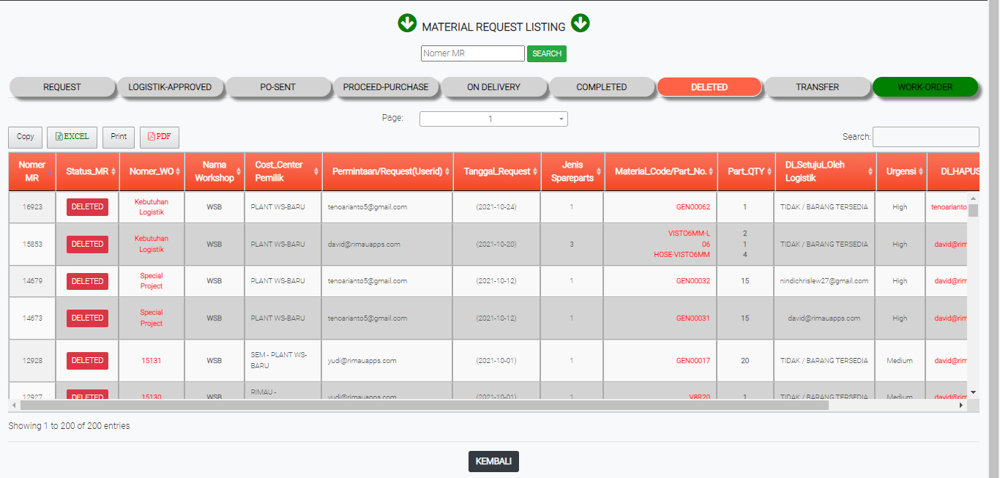

# DELETED

### DELETED

Tabel ini menginformasikan data permintaan sparepart atau barang yang dibatalkan atau dihapus oleh operator. Penghapusan hanya dilakukan ketika MR dalam keadaan request.

### FORM DELETED

Form ini akan keluar jika user meng-klik status di tabel dalated. From ini memberikan data data permintaan barang yang tidak jadi dipesan atau dibatalkan.
