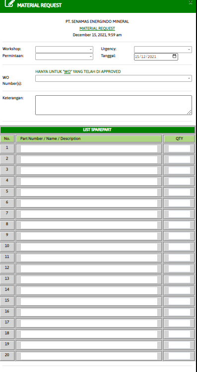

# Module MR-Request Pembelian

### MATERIAL REQUEST

Form ini digunakan untuk membuat data pembeliaan sparepart yang dibutuhkan workshop

* Workshop : Nama workshop dimana anda berada (Masukan sesuai dengan list yang di sediakan)
* Permintaan : Nama user / yang meminta (Masukan sesuai dengan list yang di sediakan)
* Urgancy : Prioritas kendaraan untuk diperbaiki (High,Medium,Low))
* Tanggal : Tanggal masuk perbaikan kendaraan  (Masukan sesuai dengan list yang di sediakan)
* WO Number : Nomor WO yang sudah di approved (Ketik dan cari sesuai list yang di sediakan)
* Keterangan : Informasikan Perbaikan kendaraan
* List Sparepart : Sparepart dan QYT yang dibutuhkan kendaraan. List sparepart akan keluar secara otomatis
